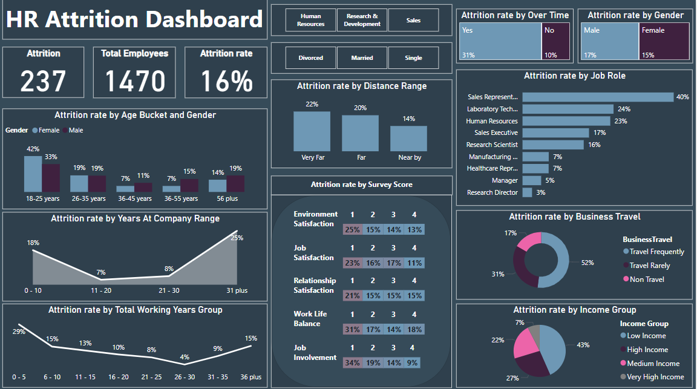
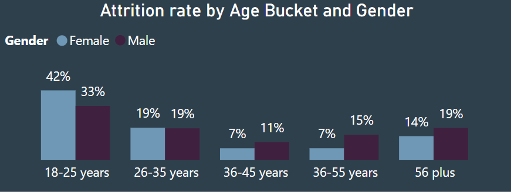
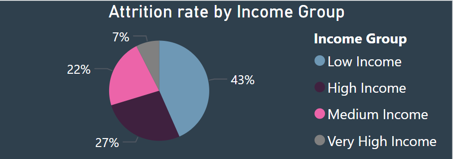
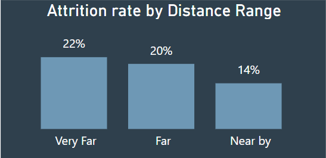
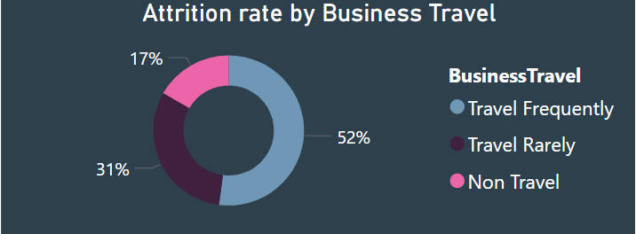
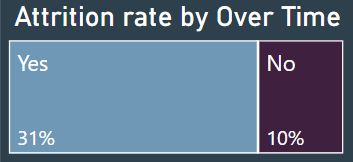
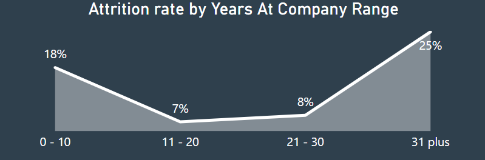
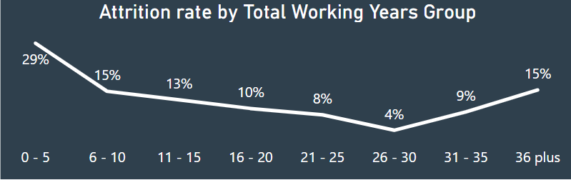
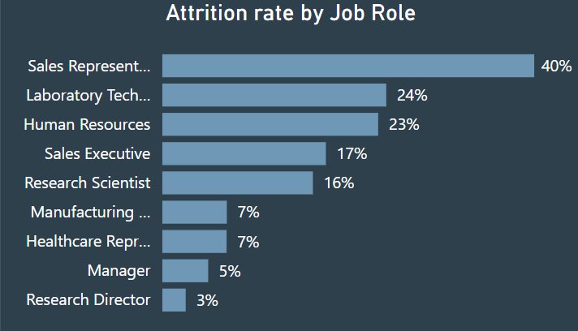
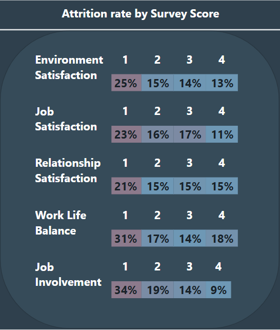

# HR Attrition Analysis

🎓 Certificate:

This project was completed as part of the Machinfy Professional Data Analysis Course.

📌 Business Task

The organization is experiencing a high employee attrition rate, which impacts recruitment costs, team performance, and productivity.
This project aims to analyze HR data to uncover key patterns, high-risk employee segments, and root causes of turnover. The insights will guide data-driven HR strategies to improve employee retention.

🗄️Data Structure

HR dataset provided by the instructor.

Rows: 1,471 employee records

Columns: 32 features including demographic data, work experience, distance from home, job satisfaction, involvement levels, travel frequency, income, and more.

🧹Data Cleaning Summary

   - Removed duplicates
   - Confirmed absence of missing values
   - Dropped unnecessary columns: EmployeeCount, Over18, StandardHours
   - Verified data types for numerical and categorical fields
     
Note: Dataset lacked timestamp data, limiting time-series analysis
See full cleaned dataset [here](Clean-HR-Employee-Attrition.xlsx)

🧠 Data Analysis & Visualization (Power BI)

Used Power BI to create interactive dashboards and visuals.

DAX (Data Analysis Expressions) was used to calculate custom metrics.
    
Created dynamic slicers for gender, job role, age group, income level, and more.

📎 Interactive Dashboard

Explore the full Power BI Dashboard [here](Finalproject1.pbix)

 

    

🔑 Key Findings
  Attrition Rate: 16% overall (237 out of 1,470 employees)
  
  Age & Gender: Highest attrition among 18–25 age group, especially females (42%)
 

    

  Income Level: Low-income employees account for 43% of total attrition
  

    

 

  Distance from Work: Employees living "Very Far" had a 22% attrition rate
  

    
 
 

  Business Travel: Frequent travelers had the highest attrition (52%)
  

    

 

  Overtime: Employees working overtime had a 31% attrition rate vs. 10% for those who didn't
  

    

 

 Tenure: Highest attrition among employees with either 0–10 or 31+ years at the company and employees with either 0–5 or 31+ working years.
 

    
    

 

 Job Role: Sales Representatives experienced the highest attrition (40%)
  

    

 

 Satisfaction Scores: Lower job involvement (34%) and work-life balance (31%) strongly correlated with higher attrition
  

    
 
 

💡 Recommendations

   - Focus on retaining early-career and low-income employees
   - Revise business travel policies and support programs for traveling staff
   - Provide support for younger employees and those with long commutes
   - Implement employee satisfaction programs, especially for job involvement and work-life balance
   - Create role-specific retention strategies for high-turnover positions like Sales and HR
